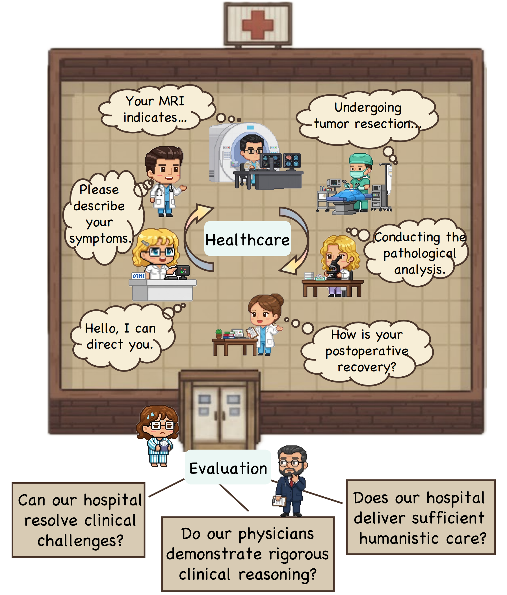
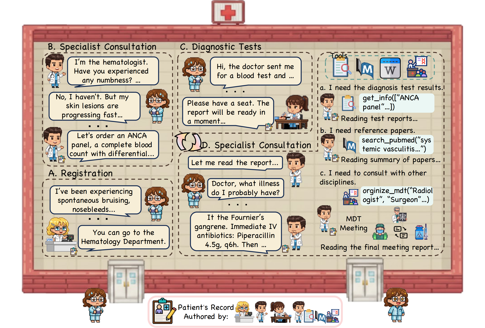

# CP-Env: A Controllable Environment for Evaluating Large Language Models in Agentic Hospital

<p align="center">

</p>

## Contents

- [Introduction](#introduction)
- [Getting Started](#getting-started)
  - [Installation](#1-installation)
  - [Running the Simulation](#2-running-the-simulation)
  - [Evaluation](#3-evaluation)
- [Metrics](#metrics)
- [Contact Us](#contact-us)
- [Citation](#citation)
  
## Introduction

**CP-Env** represents our attempt to address the critical gap in evaluating LLM-based agents for healthcare applications. While existing medical benchmarks have made valuable contributions, they primarily focus on examination-style knowledge assessment or conversational abilities in isolated patient dialogues, which may not fully capture the complexity of clinical pathways in real-world clinical practice.

In response to these limitations, we develop **CP-Env** as an open-ended, dynamic, agentic simulation hospital environment that enables LLM agents to navigate realistic clinical pathways. Our environment goes beyond traditional QA formats by simulating the complete patient care journey - from initial consultation through diagnosis and treatment. In **CP-Env**, LLM agents assume diverse healthcare roles, interact with simulated patients who accurately report their clinical conditions, and collaborate across multiple hospital departments as they traverse different pathway branches. This design allows us to evaluate not only medical knowledge but also critical capabilities such as tool utilization, pathway-based decision making, and multi-agent coordination that are essential in actual clinical settings.

<p align="center">


We hope that **CP-Env** can serve as a more comprehensive evaluation framework that better reflects the adaptive clinical pathways and dynamic decision-making required in modern healthcare delivery.

## Getting Started

### 1. Installation

Clone the repository and install the required dependencies:

```shell
git clone https://github.com/shzyk/CP-Env
cd CP-Env
pip install -r requirements.txt
```

### 2. Running the Simulation

Use `inference.py` to start the simulation. This script launches the Patient Agent and the Doctor Agent to interact through the medical cases. Ensure you have your API keys ready (e.g., OpenAI API key).

```shell
python inference.py \
    --parallel_workers 8\
    --patient_model_name "gpt-oss-120b" \
    --patient_base_url YOUR_BASE_URL \
    --patient_api_key YOUR_API_KEY \
    --doctor_model_name YOUR_MODEL \
    --doctor_base_url YOUR_BASE_URL \
    --doctor_api_key YOUR_API_KEY
```

Add `--doctor_responses_api` flag if your model requires a response API configuration.

### 3. Evaluation

After generating the simulation logs, use `evaluation.py` to compute metrics. This script uses an LLM-based evaluator to score the interactions.

```shell
python evaluation.py \
    --input_file "./outputs/model.jsonl" \
    --output "./outputs/model_evaluation_results.jsonl" \
    --model "gpt-oss-120b" \
    --base_url YOUR_BASE_URL \
    --api_key YOUR_API_KEY \
    --max_workers 4
```

To view statistics without re-running the evaluation API calls:

```shell
python evaluation.py \
    --output "./outputs/model_evaluation_results.jsonl" \
    --stats_only
```

## Metrics

CP-Env employs a comprehensive Agent Evaluation Framework that systematically evaluates LLM capabilities within agentic hospital settings through three progressive dimensions:

- **Clinical Efficacy**: Evaluates whether the agent can successfully resolve medical problems and optimize patient outcomes through accurate diagnosis and therapeutic interventions.
- **Process Competency**: Assesses whether the agent demonstrates sound and logically coherent problem-solving processes throughout the healthcare workflow.
- **Professional Ethics**: Examines whether the agent maintains ethical compliance and delivers humanistic care in patient interactions.

## Contact Us

If you are interested in our project and would like to join us, feel free to send an email to [xiaofan.zhang@sjtu.edu.cn](mailto:xiaofan.zhang@sjtu.edu.cn).

## Citation

If you find this work useful, please cite our paper.

```
@article{zhu2025cp,
  title={CP-Env: Evaluating Large Language Models on Clinical Pathways in a Controllable Hospital Environment},
  author={Zhu, Yakun and Huang, Zhongzhen and Feng, Qianhan and Mu, Linjie and Gu, Yannian and Zhang, Shaoting and Dou, Qi and Zhang, Xiaofan},
  journal={arXiv preprint arXiv:2512.10206},
  year={2025}
}
```
